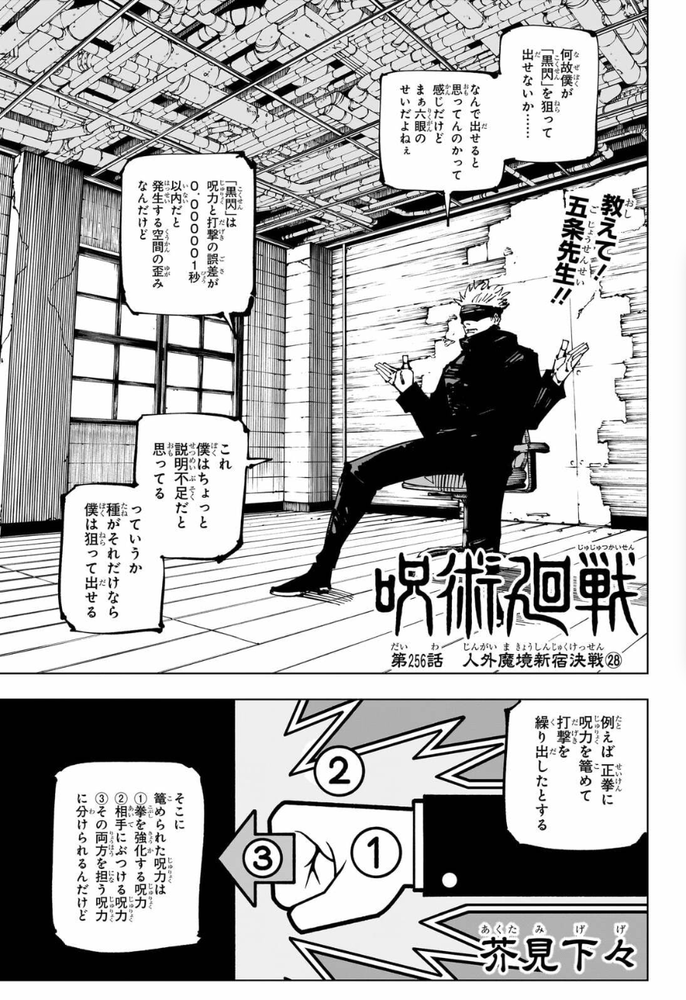
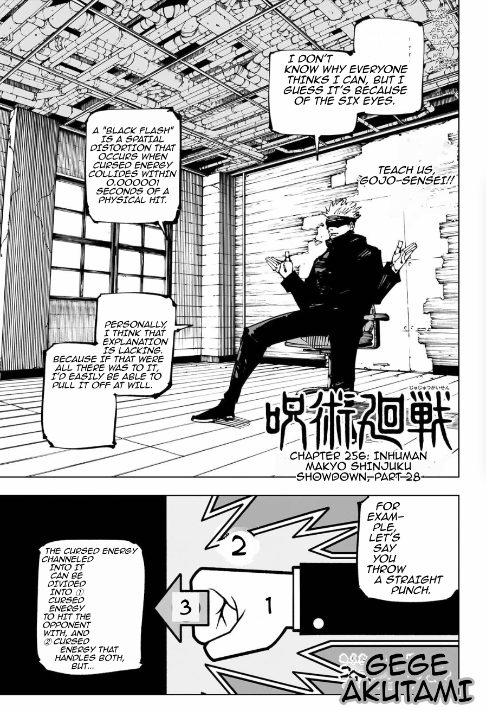

# GlassTranslate

Put a translucent window over anything on your screen and read it in your own language.

Point it at a manga page, a foreign website, or a game's dialogue box. Whatever is under the
glass gets read, translated, and redrawn on top of the original — same colours, same sizes,
same layout. It's built mainly for reading Japanese manga in English: speech bubbles are
detected properly, so a whole bubble is translated as one sentence and lettered back into the
bubble the way a real English edition would be.

| Before | After |
|:---:|:---:|
|  |  |

Everything happens on your own machine. No account, no sign-up, and nothing leaves your
computer unless you deliberately turn on an online translator.

**Windows 10 or 11.** No installer, no Python, nothing to configure.

---

## Get it running

**1. Download and unpack**

Grab `GlassTranslate-<version>-portable-win64.zip` from the
[latest release](https://github.com/mlemception/glass-translate/releases/latest) and unpack it
anywhere you like — your Desktop, a USB stick, wherever. Everything stays inside that folder.

**2. Get the models**

The app needs translation and text-reading models, which are far too big to ship in the zip.
Download `install-models.ps1` from the same release, right-click it → **Run with PowerShell**,
pick your unpacked folder, and tick what you want:

| | Size | What it does |
|---|---|---|
| **manga-ocr** | 192 MB | Reads the Japanese text off the page. **Get this one.** |
| **Sugoi v4** | ~700 MB | Much better manga translation than the default. Worth it. |
| **Quality renderer** | 9.5 GB | Redraws the artwork hiding behind erased text. Needs an NVIDIA graphics card. |

You can skip the script entirely if you'd rather — the app downloads what it needs by itself
the first time you run it. The script just lets you do it upfront and pick exactly what you want.

**3. Run `GlassTranslate.exe`**

That's it.

---

## Using it

You get **two windows**:

- **The control window** — a normal window with all the settings, a Start/Stop button, and a
  live readout of how fast things are running.
- **The glass** — a floating, see-through window you position over whatever you want to read.
  You can click straight through it, so it never gets in your way.

**To move or resize the glass**, turn on *grab mode* (`Ctrl+Alt+G`). The glass gets a border
and handles: drag it around, drag the corner to resize, then press `Escape` when you're done.

| Shortcut | What it does |
|---|---|
| `Ctrl+Alt+G` | Move / resize the glass |
| `Ctrl+Alt+T` | Start or stop translating |
| `Ctrl+Alt+H` | Show or hide the glass |

**Worth knowing:**

- **Manga mode** is on by default. It groups speech bubbles so a whole bubble is translated as
  one sentence instead of line by line. Leave it on for comics; turn it off for websites and
  UI text.
- **Quality renderer** (Engines tab) is off by default. If you installed it and have an NVIDIA
  card, turn it on — it regenerates the artwork behind erased Japanese text so the page looks
  like the text was never there. Without it you still get a clean result, just simpler.

---

## If something goes wrong

**Nothing gets translated.** You probably have no translation model installed yet. Run
`install-models.ps1`, or use the *Download model…* button in the control window.

**Japanese comes out as `<unk>` or nonsense.** That's the generic model struggling with short
comic dialogue. Install **Sugoi v4** — it's trained on exactly this kind of text.

**It's slow.** Reading the text is the slow part. Make the glass smaller — it only processes
what's underneath it.

**Text is cut off or too small.** Translations are often longer than the original, and they're
shrunk to fit rather than spilling over the artwork. A very small bubble with a long line will
end up with small text.

**Sharing your folder with someone?** If you added a Gemini API key, it's saved as plain text
inside `config\`. Delete that file first.

---

## Under the hood

Curious how it works, want to build it yourself, or want to add your own translation engine?

### → **[Technical documentation (wiki)](https://github.com/mlemception/glass-translate/wiki)**

Architecture, every dependency and why it was chosen, the portable-bundle format, how manga
lettering actually works, the generative quality renderer, the test suites, and a full list of
known limitations.

Jump straight to:
[Architecture](https://github.com/mlemception/glass-translate/wiki/Architecture) ·
[Manga typesetting](https://github.com/mlemception/glass-translate/wiki/Manga-Typesetting) ·
[Quality renderer](https://github.com/mlemception/glass-translate/wiki/Quality-Renderer) ·
[Building from source](https://github.com/mlemception/glass-translate/wiki/Building-from-Source) ·
[Known limitations](https://github.com/mlemception/glass-translate/wiki/Known-Limitations)

Also in this repo: [module contracts](docs/ARCHITECTURE.md) ·
[control-window design](docs/GLASS_DESIGN.md) · [model licences](renderer/MODELS.md) ·
[benchmarks](docs/perf/)

---

## Licence and credits

Lettering uses **Anime Ace 2.0 BB** by Nate Piekos / [Blambot](https://blambot.com) — free for
independent comic and non-profit use, and not redistributable without permission.

Translation and image models are downloaded from their original sources, each under its own
licence. **Sugoi v4 is research-use only and may not be redistributed** — which is why it isn't
bundled and you download it yourself. Full provenance for every weight is in
[renderer/MODELS.md](renderer/MODELS.md).
